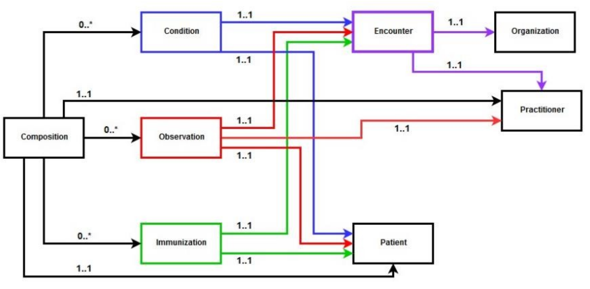

# Instance of the document
The generation of the document is implemented in the single file [Impfausweis.java]("https://github.com/Bundel48/FHIR/blob/master/IntellijProject/MIOProjektImpfausweis/src/main/java/IntellijProject/MIOProjektImpfausweis/src/main/java/Impfausweis.java")
## Data structure

## General
To generate the different FHIR structures, we have created separate
functions, e.g. createPatient, which can be used to create different
representations of the structure. 
In the main method, all necessary instances of our
structures are created, then packed into a bundle and loaded onto
the server.    